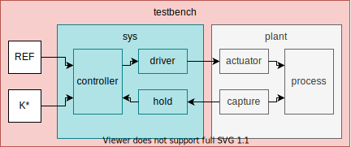
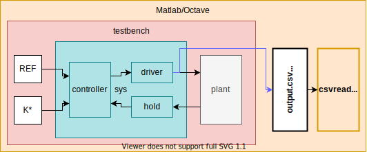
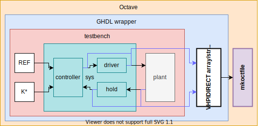
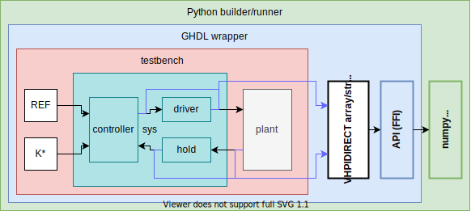
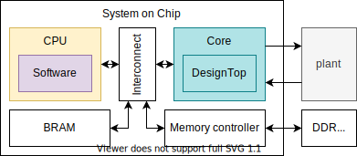
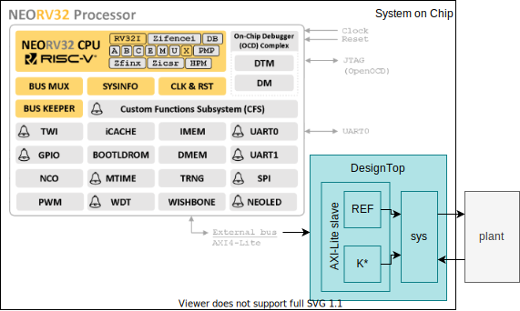
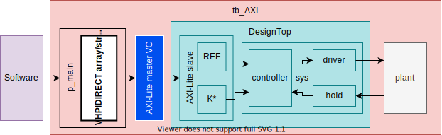
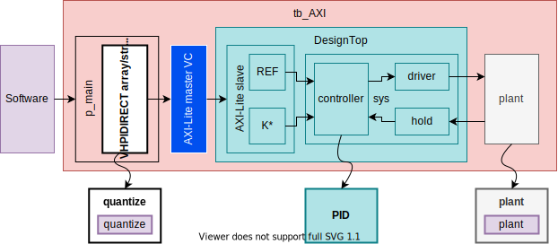

= Co-simulation and behavioural verification with VHDL, C/C++ and Python/m: Máster en Sistemas Electrónicos Avanzados (SIEAV)
:author: Unai Martinez-Corral
:email: unai.martinezcorral[at]ehu[dot]eus
:title-page:
:sectnums:
:icons: font
:stem:
:reproducible:
:toc:
:listing-caption: Listing
:repotree: https://github.com/umarcor/SIEAV/tree/main/

== Introduction

Tras familiarizarnos con las herramientas libres para simulación y testing/verificación de VHDL, así como con la
documentación sobre cosimulación con VHPIDIRECT, el propósito del ejercicio propuesto es relacionar dichos recursos
con los contenidos tratados en las otras partes del curso.

Utilizando como referencia el típico sistema de control en lazo cerrado con una planta SISO (Single Input Single Output)
y un controlador también SISO (ver xref:img-control[xrefstyle=short]), se propone co-simular la interacción entre el software y el hardware en un System on Chip
(SoC) que integre una CPU y un core.

[#img-control]
.Closed-loop system with a SISO plant and a SISO controller.
[link=img/control.svg]

* El subsistema `sys` representa los componentes lógicos a ser implementados en hardware: el controlador, la lógica de
  captura y retención, y la lógica de actuación.
* El subsistema `plant` representa los componentes físicos que componen la planta a controlar, incluyendo cualquier
  actuador o dispositivo de captura externo al diseño (V)HDL sintetizable.

En entornos de desarollo basados en modelos, como pueden ser Matlab/Simulink, el interés se centra en la disposición de
modelos fidedignos de cada uno de los componentes del sistema.
Pueden usarse el lenguaje `m` y/o bloques de simulink para definir el proceso, los actuadores, dispositivos de medida,
etc. al mismo tiempo que se utiliza VHDL para modelar el controlador, incluyendo la estrategia de retención, lógica
de lectura y/o _driver_ del actuador.
El entorno gestiona la comunicación, permitiendo la ejecución simultanea de varios _kernels_ (al menos, un
simulador por eventos, discreto; y un simulador continuo, un _solver_) de forma transparente al usuario.

En las sesiones del curso, hemos visto alternativas a dicha comunicación, utilizando ficheros (xref:img-control-file[xrefstyle=short]), cosimulación mediante
compilación (xref:img-control-mkoctfile[xrefstyle=short]), o cosimulación mediante uso de librarías compartidas
(xref:img-control-py[xrefstyle=short]).
En todos los casos, se ha optado por implementar el modelo de todos los componentes del sistema en (V)HDL, tanto los
sintetizables como la planta en si.
La comunicación se ha utilizado, por tanto, para ilustrar diferentes estrategias para capturar y graficar los resultados.
Concretamente, para usar los _plot_ de Matlab/Octave o numpy.

[#img-control-file]
.Sharing data between Matlab/Octave and an HDL simulation through text or binary files.
[link=img/control_file.svg]

[#img-control-mkoctfile]
.Sharing data between Octave and an HDL simulation by using cosimulation and building an mkoctfile.
[link=img/control_mkoctfile.svg]

[#img-control-py]
.Sharing data between Python and an HDL simulation by using cosimulation and dynamic loading.
[link=img/control_py.svg]

En el sistema real, la transmisión de información/energía entre el controlador y la planta (o la monitorización de
dichas señales) se realiza externamente a la FPGA.
Por lo tanto, los resultados obtenidos en una simulación basada en modelos es tan fiel como detallados sean los modelos
utilizados.
En este sentido, una solución basada únicamente en simulación discreta tiene poco que aportar desde un punto de vista de precisión en el modelado, en comparación con la disposición de modelos continuos detallados de la planta, los actuadores,
etc.
Por ello, en estos aspectos, me remito a los contenidos tratados por Koldo y Edorta, tanto en este mismo curso como
en "_Diseño de controladores digitales con FPGAs_".
Sin embargo, en lo que respecta al (V)HDL, el resultado de la simulación debería ser exactamente igual al comportamiento
del circuito implementado.
Es, por lo tanto, deseable poder utilizar la misma implementación tanto para simulación como para síntesis, en vez de
mantener un modelo de simulación en C o m, que sea suficientemente fiel al (V)HDL.

== From a core to a System on Chip

Hoy en día la amplia mayoría de diseños hardware basados en FPGA son, en realidad, diseños System-on-Chip (SoC) que
incluyen, al menos, una CPU a modo de orquestador (ver xref:img-control-soc[xrefstyle=short]).
Esto es debido a que las CPUs son más adecuadas para la ejecución de lógica arbitraria cuyo rendimiento no resulta
crítico.
Por ello, además de la comunicación entre el hardware y la planta, es necesario desarrollar e implementar la
comunicación (y coejecución) entre el software y el hardware en el sistema final.
Para ilustrarlo en el sistema de ejemplo, supongamos que la consigna y ciertos parámetros del controlador son
configurables desde la CPU, en tiempo de ejecución.
Es decir, en vez de sintetizar un controlador para cada conjunto de parámetros (indicados como constantes en VHDL),
deseamos disponer de un PID que pueda ser sintetizado una sola vez, y después los parámetros (puertos) puedan ser
modificados durante la ejecución.

[#img-control-soc]
.A System on Chip consisting of a single soft CPU and a single peripheral Core, connected to a plant.
[link=img/control_soc.svg]
image::img/control_soc.svg[control_soc, align="center"]

Existen herramientas automáticas de particionamiento hardware-software que permiten modelar/diseñar tanto la CPU como el
core en un lenguaje común, y después generar implementaciones específicas para el software en la CPU y para el Core.
Dichas soluciones se denominan _High Level Synthesis_ (HLS).
Hay otras herramientas de alto nivel que, sin denominarse HLS, ofrecen una solución similar.
Es el caso de HDL Coder de Mathworks.
Dichas soluciones están típicamente basadas en librerías y _cores_ prediseñados que se instancian de forma transparente
al usuario.
Proveen drivers software y realizan la instanciación de los componentes de interconexión de forma que el usuario sólo
debe gestionar la implementación de la lógica en software y en hardware.
Por ello, debe tenerse presente que el propósito de dichas herramientas es reducir el tiempo de prototipado, ofreciendo
soluciones que se ajustan a la mayoría de casos de uso.
No buscan la máxima optimización o cubrir lo casos más complejos o específicos.

En la práctica, un diseño SoC tiene el aspecto mostrado en la xref:img-control-socmem[xrefstyle=short].
Además de la CPU y el Core, hay una interconexión entre ambos, y varios periféricos adicionales conectados a la misma.
Por lo tanto, existen multiples componentes en el sistema que pueden interactúan y afectar tanto al software como al
Core objetivo.
Al utilizar herramientas que generan dichos recursos automáticamente, el usuario no alcanza a ver (y por tanto entender)
los detalles de cómo se transfieren los parámetros en el sistema final, dificultando así la depuración de los diseños.
Nótese que en aplicaciones de machine-learning, procesado de imagen/vídeo/audio, etc. la interdependencia
hardware-software es tan estrecha como lo es la comunicación entre el controlador y la planta en un sistema de control.

[#img-control-socmem]
.A System on Chip composed by a CPU and an interonnect with several peripherals, including the controller for an external DDR memory.
[link=img/control_socmem.svg]

Es por ello que el paso de la simulación del sistema de control (`sys`) a la implementación de un sistema
software-hardware en FPGA no es trivial desde el punto de vista de la ingeniería.
Aún habiendo estudiado la planta y el controlador, y teniendo la descripción hardware optimizada, se requiere entender
la interacción entre el software y el hardware.

== Software-hardware modelling using cosimulation and Verification Components

Las herramientas libres y las interfaces de cosimulación son una alternativa o complemento para implementar, verificar y
estudiar sistemas hardware-sofware basados en protocolos estandarizados.
Como vimos en el ejemplo basado en AXI Stream, los frameworks/metodologías de verificación como VUnit, OSVVM o cocotb
proveen componentes denominados Verification Component (VC) y/o Bus Functional Model (BFM), implementados en (V)HDL o
en Python, que ofrecen una conversión entre una API software y las señales hardware del protocolo correspondiente.
Es decir, establecen el límite en la abstracción entre qué es software y qué es hardware en el diseño final,
independientemente del lenguaje utilizado.
Podemos usar dichas abstracciones para partir de un modelo equivalente a xref:img-control-soc[xrefstyle=short] y
detallarlo iterativamente hasta obtener xref:img-control-socmem[xrefstyle=short].

El ejercicio propuesto aplica dicha estrategia al diseño del sistema para control en lazo cerrado.
Supongamos que el PID fuera a ser implementado junto con el diseño SoC disponible en https://github.com/stnolting/neorv32[stnolting/neorv32].
En lo que respecta a este ejercicio, es una CPU genérica.
Podríamos suponer que se trata de un Zynq, o un SoC generado con los kits de ARM o SiFive, o cualquier otro diseño de
_soft_ CPU que tengamos disponible.

[#img-control-neorv32]
.A minimal System on Chip composed by a NEORV32 CPU subsystem and a Core with an AXI-Lite _slave_ interface.
[link=img/control_neorv32.svg]

NEORV32 dispone de un puerto para conectar periféricos a través de un bus externo.
Se trata de un bus al uso para dispositivos mapeados en memoria, consistente en una dirección, un dato y operaciones de
lectura o escritura.
Es compatible con Wishbone o con AXI-Lite.
Por lo tanto, es necesario que nuestro diseño (core) sintetizable disponga de una interfaz compatible.
En este caso, se ha optado por implementar un AXI-Lite _slave_ que contiene cuatro registros de 16 bits en las
direcciones `0x0`, `0x2`, `0x4` y `0x6`.
Se corresponden con la consigna (Ref) y las constantes (Kp, Ki y Kd), respectivamente.

[NOTE]
====
El diseño del componente AXI-Lite _slave_ sintetizable (que gestiona el protocolo y escribe/lee los registros) está
fuera del alcance de este curso.
Se provee junto con el resto de ficheros VHDL del ejemplo.
No obstante, las siguientes referencias pueden ser de interés:

* https://github.com/Architech-Silica/Designing-a-Custom-AXI-Slave-Peripheral[Architech-Silica/Designing-a-Custom-AXI-Slave-Peripheral]
* http://indico.ictp.it/event/8342/session/16/contribution/101/material/slides/0.pdf[Cristian Sisterna. Introduction to AXI –Custom IP. Advanced Workshop on FPGA-based Systems-on-Chip for Scientific Instrumentation and Reconfigurable Computing]
* https://www.xilinx.com/support/documentation/sw_manuals/xilinx2019_1/ug1119-vivado-creating-packaging-ip-tutorial.pdf[Vivado Design Suite. Creating, Packaging Custom IP Tutorial. UG1119 (v2019.1)]
====

En un principio, necesitamos comprobar que nuestra lógica es correcta; tanto el PID, como el AXI-Lite _slave_, y también
el software específico para nuestra aplicación.
Por lo tanto, no es necesario simular el código RTL de la CPU o de todo el SoC inicialmente.
Hacerlo tendría impacto en el rendimiento (tiempo de simulación) y nos expondría a posibles _bugs_ ajenos a nuestra
lógica.
En ocasiones, el subsistema de la CPU no se encuentra desarrollado o finalizado aún, por lo que no es posible la
simulación de todo el sistema en conjunto.
Por ello, la metodología propuesta consiste en utilizar sólo el software que se ejecutará en la CPU y sólo la parte
funcional del Core.
La comunicación entre ambas partes se abstrae utilizando cosimulación y un Verification Component (ver xref:img-control-axilite[xrefstyle=short]).

[#img-control-axilite]
.Simulation model abstracting the software-hardware communication through a cosimulation interface and a Verification Component.
[link=img/control_axilite.svg]

[NOTE]
====
En este ejercicio se asume que el software es código C genérico, y que no se requiere su ejecución en la misma
arquitectura que el sistema final.
No obstante, si dicho código dependiera de características sólo disponibles en una arquitectura de procesador concreta,
existen dos alternativas:

* Utilizar QEMU, ya sea qemu-user (sólo la CPU) o qemu-system (todo el subsistema).
  Ver https://github.com/dbhi/qus[dbhi/qus].
* Ejecutar el software nativamente. Puesto que las herramientas libres pueden compilarse y funcionan en ARM y/o RISCV,
  es posible ejecutar la simulación del hardware en el mismo dispositivo.
  Alternativamente, puede usarse comunicación remota para ejecutar el software en un dispositivo y la simulación del
  hardware en otro diferente.
  Ver https://dbhi.github.io[dbhi.github.io] (https://dbhi.github.io/pdf/FPGA2020_poster.pdf[FPGA2020_poster.pdf]).
====

== Exercise sources

=== Software

El software (`control/c/caux.c`), contiene un array de cuatro valores de tipo _double_ donde se definen la consigna y
las constantes del controlador.
Hay también un array de 6 elementos de tipo _double_ para definir la trayectoria a seguir.
Además, se definen dos funciones:

* `handleInterrupt` emula la rutina de atención a una interrupción generada por el hardware.
* `getParamsPtr` es una función auxiliar para permitir al simulador VHDL obtener el puntero al array de parámetros.

=== Testbench

En el testbench (`control/test/tb_AXI.vhd`), además de instanciarse el diseño, el VC y la planta, el proceso `p_main`
orquesta la ejecución.
Recordemos que el simulador hardware es la raíz de la ejecución, y este el proceso principal.
En el, se utiliza el procedimiento `cosimTest` para:

* Obtener el puntero a los parámetros.
* Enviar los valores iniciales (referencia/consigna y constantes) a través del AXI-Lite.
* Cada `100 us` y por seis veces, ejecutar `handleInterrupt` e inmediatamente después enviar/actualizar el valor de la
  referencia/consigna a través del AXI-Lite.

Es en dicho procedimiento donde se convierten los valores de tipo _double_/_real_ a _std_logic_vector_ de 16 bits, que
es el formato utilizado en las transmisiones AXI.
Se realiza la cuantificación de los valores aprovechando las facilidades ofrecidas por los `fixed_generic_pkg` de las
librería IEEE en VHDL.

[NOTE]
====
Nótese que el contenido de los componentes `controller`, `driver`, `hold` y `plant` son sólo fachada.
Es decir, las arquitecturas son muy mínimamente funcionales, lo suficiente para poder simular el sistema y obtener
alguna señal que pueda ser interpretada.
Se pretende representar el estado inicial/genérico de un modelo del sistema, antes de comenzar con la descripción de los
detalles relativos a una aplicación concreta.
====

=== DesignTop

El AXI-Lite _slave_ expone los cuatro registros de 16 bits, en los que escriben los valores recibidos del VC.
Los cuatro registros están conectados directamente a puertos de entrada del controlador (`control/src/ControllerWithExtParams.vhd`).

=== Execution

Se provee un script de VUnit (`control/run.py`) que permite ejecutar los testbench correspondientes a este ejercicios,
entre otros.
El testbench a utilizar como referencia es `lib.tb_axi.cosim`.
Es decir, se recomienda ejecutar `python3 run.py -v lib.tb_axi.cosim` o `python3 run.py -v -g lib.tb_axi.cosim`.
Existe también un test denominado `sim`, definido en el mismo testbench.
Sin embargo, `sim` no utiliza cosimulación y, por tanto, no obtiene las constantes y consignas del software.

== Assignment

La tarea a realizar consiste en modificar el sistema de una o varias de las formas propuestas a continuación e
ilustradas en xref:img-control-assignment[xrefstyle=short].

[#img-control-assignment]
.TODO.
[link=img/control_assignment.svg]

=== Cuantificación y conversión

En una aplicación final donde el software se ejecute _bare-metal_, no se dispone de las facilidades de VHDL o Matlab
para convertir los números en coma flotante a arrays de bits en coma fija.
Aunque se pudiera sintetizar hardware para hacerlo, no resulta razonable a priori.
Lo razonable en esta aplicación es que sea el software quien realice la conversión antes de enviar los datos a través
del bus.
Por lo tanto, puede haber una diferencia entre los resultados obtenidos con el uso de `to_sfixed` en `cosimTest`
(`control/test/tb_AXI.vhd`), y los producidos por la rutina software.

La modificación propuesta es realizar la cuantificación y conversión (una función equivalente a `to_sfixed`) en C
(`control/c/caux.c`). El prototipo podría ser `int16_t double2int16 (double x, int left, int right)`.

* Se puede declarar como _foreign_ en VHDL, y utilizarla en `cosimTest`.
* Se puede utilizar en C directamente, antes de enviar los datos al simulador.
  Es decir, modificando el array `params` para que sea de tipo `int32_t`, y ajustando `getParamsPtr` coherentemente.

La implementación en C es libre. Se puede escribir a mano, se pueden utilizar librerías, se puede utilizar el C Coder de
Matlab, o cualquier otra solución, siempre y cuando el resultado sea compilable y ejecutable.
La implementación puede ser completamente ad-hoc, ya que el objetivo principal es la cosimulación y la coherencia entre
los prototipos en VHDL y C.
No es el objetivo evaluar la implementación concreta de la función.

=== Integración de un PID

El controlador provisto es sólo proporcional.
Dispone de puertos Kp, Ki y Kd, pero sólo el primero de ellos se utiliza.
Además, el sistema no está ajustado en absoluto.
Los valores de las constantes son arbitrarios.

La modificación propuesta es integrar un PID existente o extender alguna de las arquitecturas provistas para implementar
un PID sintetizable.
A quienes dispongáis del controlador desarrollado en el curso "_Diseño de controladores digitales con FPGAs_", os
sugiero intentar integrarlo, ya que los valores y el formato de todas las constantes os son conocidos.
En principio, deberíais poder copiar y pegar la arquitectura del PID que dispongáis, y únicamente ajustar los tamaños
de las señales de entrada/salida de/a la planta.
Sin embargo, dependiendo del tipo de implementación de la que dispongáis, las constantes Kp, Ki y Kd pueden no coincidir
con vuestra estructura.
Deberéis ajustar el número de registros que gestiona el AXI-Lite _slave_, y conectar los puertos adicionales al
controlador.
En cualquier caso, deberéis ajustar el uso de `to_sfixed` en `cosimTest` (`control/test/tb_AXI.vhd`), y los valores de
`params` en (`control/c/caux.c`).

No es el objetivo implementar la calidad del control, o el comportamiento del sistema.
Lo que se pretende es entender el camino seguido por los datos (las constantes) desde el software hasta el controlador.

=== Modelado de la planta

La planta provista no responde a ninguna metodología de modelado y/o identificación de sistemas.
Es un simple contador con signo saturado a ambos extremos, que se incrementa o decrementa con cada ciclo habilitado de
reloj.

La modificación propuesta consiste en implementar un modelo de planta que tenga algún sentido.
Sea una planta de primer orden o de segundo orden, sea en VHDL o en C, el objetivo es hacer los ajustes necesarios para
que el resultado de la simulación coincida con el mismo sistema modelado en Simulink.
Es razonable implementar la planta utilizando _real_ en VHDL o _double_ en C, puesto que la planta no debe ser
sintetizable.
No obstante, la entrada y la salida deben coincidir con los tipos (`std_logic_vector`) indicados en la entidad.

Es importante que el resultado coincida (dentro de un margen de error aceptable) con el control obtenido en Simulink
(usando un controlador proporcional como en el VHDL facilitado).
Sin embargo, no es el objetivo la calidad del control.
Lo que se pretende es entender cómo se puede utilizar VHDL para combinar hardware y software, y cómo deben representarse
los valores y convertirse en cada caso.

== Report

El propósito de la tarea es que dediquéis (al menos) cuatro horas a utilizar, entender y modificar el sistema de
referencia proporcionado.
Deberéis entregar las fuentes de los ejercicios/modificaciones que hayáis realizado.
Es importante que guardéis el mayor número de pruebas que realicéis.
No es necesario que estén perfectas, ni siquiera completas.
Es posible que algunos no lleguéis a finalizar cualesquiera modificaciones que os propongáis hacer, lo cual es aceptable
y parcialmente esperado.
Junto con las fuentes, deberéis entregar un informe breve (1-3 páginas) de valoración sobre los temas tratados.
Algunas ideas:

* Qué pretendíais hacer en el ejercicios y qué habéis podido hacer o no.
* Qué habéis aprendido/entendido y qué es lo que no os ha quedado claro.
* Qué utilidad encontráis en estas herramientas libres y qué dificultades.
* Qué facilidades o dificultades encontráis en comparación con las otras formas de trabajar vistas en la asignatura.

En el informe, no debéis explicar los ejercicios ni referenciar la documentación o los ficheros que os he facilitado.
Podéis también omitir cualquier otra referencia generalista.
Id al grano.
Lo que se va a evaluar es si habéis dedicado el tiempo indicado, al menos, y si algo habéis entendido o no, de estas
sesiones.
No hay respuestas correctas o incorrectas per se, ya que cada cual se encontrará con los problemas y los resolverá de
forma diferente.
Necesito que plasméis esos problemas, ya que son el indicativo de haberse enfrentado al reto.
Si os resultara fácil (no encontrarais problemas), siempre podéis mostrar la dedicación mediante un compendio de las
muchas pruebas diferentes que hayáis podido hacer, y por qué las habéis hecho.

El informe, preferiblemente en formato PDF, debéis entregarlo a través de e-gela.
Las fuentes de los ejercicios/modificaciones que hagáis, podéis entregarlos a través de e-gela también.
En su caso, debéis hacer un zip/tarball junto con el PDF.
Alternativamente, podéis crear un _fork_ (puede ser privado) del repositorio en GitHub, y facilitarme acceso.
