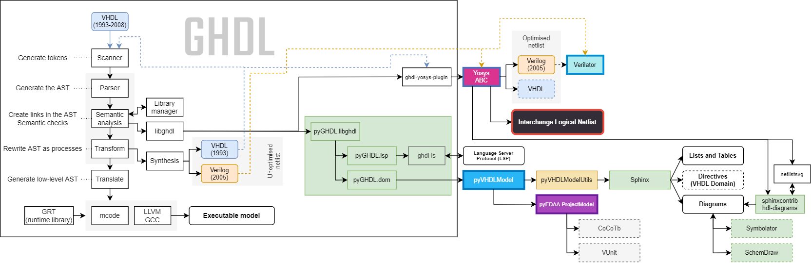

.. _VHDL:

VHDL, a programming language
############################

*Verification and Hardware Description Language* (VHDL) is not a hardware description language only (anymore)!

* Analysis, elaboration and runtime
* Unified compilation tools
* Hardware Description Languages
* HDL generators
* HDL simulation
* GHDL
* Cosimulation

   GHDL, a VHDL toolkit.

*TBC*
