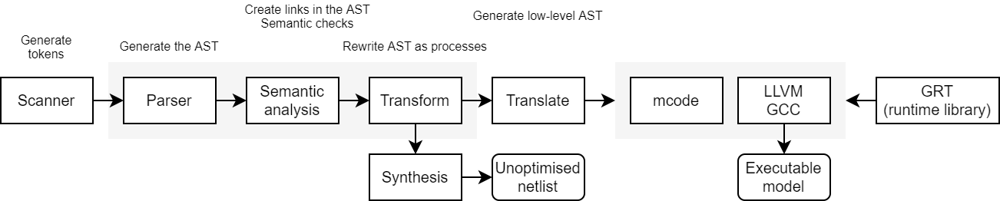

[NOTE]
====
This repository and documentation contain resources used in some sessions of the "_Cosimulation for verification of
systems on FPGAs_" ("_Cosimulación para la verificación de sistemas sobre FPGAs_") course unit taught in the
https://www.ehu.eus/es/web/master/master-sistemas-electronicos-avanzados[Master on Advanced Electronic Systems (Máster en Sistemas Electrónicos Avanzados)]
at the https://www.ehu.eus[University of the Basque Country (UPV/EHU)].
Find the syllabus:
https://www.ehu.eus/es/web/master/master-sistemas-electronicos-avanzados/materia?p_anyo_ofd=20190&p_anyo_pop=20170&p_cod_centro=345&p_cod_materia=9117&p_cod_asignatura=504738&p_tipo_asignatura=1[2019/2020],
https://www.ehu.eus/es/web/master/master-sistemas-electronicos-avanzados/materia?p_anyo_ofd=20200&p_anyo_pop=20170&p_cod_centro=345&p_cod_materia=9117&p_cod_asignatura=504738&p_tipo_asignatura=1[2020/2021].

These sessions are a follow-up of the course unit "_Design of digital controllers with FPGAs_" ("_Diseño de
controladores digitales con FPGAs_") taught in the same master degree (https://www.ehu.eus/es/web/master/master-sistemas-electronicos-avanzados/materia?p_anyo_ofd=20200&p_anyo_pop=20170&p_cod_centro=345&p_cod_materia=9120&p_cod_asignatura=504740&p_tipo_asignatura=1[2020/2021]).
Hence, attendants are expected to have prior knowledge about the fundamentals of control theory (discretization of state-space representation and transfer-functions, sampling and PID algorithms/implementations).
Nonetheless, these sessions are focused on VHDL language features, not on control.

The course is taught in spanish and/or basque (for now); so, some references might not be available in english (yet).
Still, most of the documentation and code examples should be readable to any english speaker.
Should you find any issue in this regard, please https://github.com/umarcor/SIEAV/issues/new[let us know]!
====

== Introduction

The summary of these sessions is the following:

* VHDL is not a hardware description language only (anymore)!
* Installation of https://hdl.github.io/awesome/items/ghdl[GHDL], https://hdl.github.io/awesome/items/vunit[VUnit], https://hdl.github.io/awesome/items/gtkwave[GTKWave], https://hdl.github.io/awesome/items/ghdl-yosys-plugin[ghdl-yosys-plugin] and https://hdl.github.io/awesome/items/yosys[Yosys].
* Introduction to VUnit as a unit testing manager.
* Control system modelling in VHDL 2008:
** From 64-bit floating-point to custom fixed-point.
*** https://umarcor.github.io/osvb/notebook/fpconv[OSVB: fpconv]: data type exploration and visualization in arithmetic algorithms/circuits.
** From a single process to a spatial synthesizable design.
*** Clocking schemes.
** Passing complex generics/parameters through https://hdl.github.io/awesome/items/json-for-vhdl[JSON-for-VHDL].
** From an isolated core to a software-hardware partitioned design.
*** Introduction to VUnit's AXI http://vunit.github.io/verification_components/user_guide.html[verification components].
*** Direct cosimulation: VHDL and C/Python.
* Assignment/exercise: SISO AXI4 Stream DSP core.

=== Development Environment 101

* https://missing.csail.mit.edu[missing.csail.mit.edu: The Missing Semester of Your CS Education]
* https://lab.github.com[lab.github.com]
* https://unixgame.io/unix50[The UNIX Game]
* https://github.com/ossu/computer-science[Open Source Society University: Computer Science]
* https://www.debuggingbook.org[debuggingbook.org]

== VHDL, a programming language

* Analysis, elaboration and runtime
* Unified compilation tools
* Hardware Description Languages
* HDL generators
* HDL simulation
* GHDL
* Cosimulation

[#img-ghdl]
.GHDL
[link=img/ghdl.png]

== Installation of FLOSS EDA tools

_TBC_

== Introduction to VUnit

_TBC_

== Control system modelling in VHDL 2008

_TBC_

== Assignment/exercise

_TBC_

:numbered!:

[bibliography]
== References

[bibliography]
.Books
- [[[taoup]]] Eric Steven Raymond. 'The Art of Unix Programming'. Addison-Wesley. ISBN 0-13-142901-9.
- [[[walsh-muellner]]] Norman Walsh & Leonard Muellner. 'DocBook - The Definitive Guide'. O'Reilly & Associates. 1999. ISBN 1-56592-580-7.

[bibliography]
.Articles
- [[[abc2003]]] Gall Anonim. 'An article', Whatever. 2003.

[glossary]
== Glossary

[glossary]
A glossary term::
  The corresponding (indented) definition.

A second glossary term::
  The corresponding (indented) definition.
