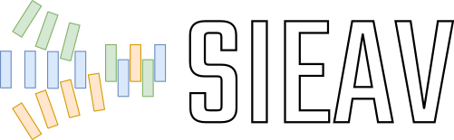

Co-simulation and behavioural verification with VHDL, C/C++ and Python/m
########################################################################

.. include:: Introduction.inc

.. toctree::
  :hidden:

  Home <http://umarcor.github.io/SIEAV>
  VHDL
  Co-design
  Installation

.. toctree::
  :caption: Exercises
  :hidden:

  exercises/ghdl_vunit
  exercises/matrices
  exercises/control
  exercises/logging
  exercises/hsces
  exercises/octave
  exercises/xyce

.. toctree::
  :caption: Appendix
  :hidden:

  Slides
  DevEnv101
  License
  Doc-License
  References
