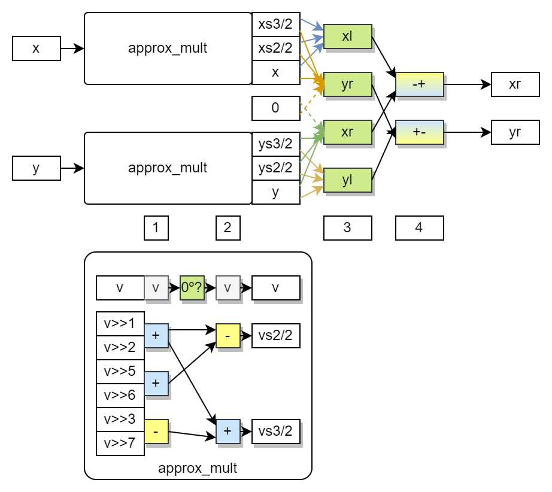

# Logging and checks for behaviour/test driven development using digital twins from software to RTL on FPGA

This exercise illustrates the "from software only to synthesisable RTL" subset of [gh:umarcor/hsces:doc: [B|T]DD + SCM + CI](https://gitlab.com/umarcor/hsces/-/blob/main/doc/BTDDCI.md).
Starting from a mathematical operation to be computed with a vector of multiple items, the sources and history of this
exercise show how to implement and test a model in software using Python, then manually translate it to software using
VHDL, and progressively modify the VHDL description to make it synthesisable, to finally test it on a SoC with FPGA.
However, this exercise is purposedly not complete, but open for anyone to tackle the proposed tasks for self-learning.

## Tools and devices

- VUnit (for simulation)
  - [gh:vunit/vunit: open source unit testing framework for VHDL/SystemVerilog](https://github.com/vunit/vunit)
  - [gh:vunit/tdd-intro: introduction to Test-Driven Development (TDD) and Continuous Integration (CI) with VUnit](https://github.com/vunit/tdd-intro)
- GHDL (for simulation and synthesis)
  - [gh:ghdl/ghdl: open source analyzer, compiler, simulator and synthesizer for VHDL](https://github.com/ghdl/ghdl)
- (Optional) GtkWave (for simulation)
  - [gh:gtkwave/gtkwave: open source wave viewer for which reads VCD/EVCD, LXT, LXT2, VZT, FST, and GHW](https://github.com/gtkwave/gtkwave)
- (Optional) PYNQ development board (PYNQ-Z1, Arty-Z7, ZCU104, KV260...) and Vivado (for synthesis and implementation)
  - [pynq.io: open source project to use Adaptive Computing platforms with an ecosystem of Python libraries](https://www.pynq.io/)
  - [pynq.io: Development Boards](https://www.pynq.io/boards.html)

## Statement

Design a hardware accelerator (RTL core) to rotate 45º counterclockwise about the origin of a two-dimensional Cartesian
a vector of arbitrary length containing unrelated 2D point coordinates.
Set reasonable limits for the length of the vector and the precision of the fixed-point words depending on the target
SoC/FPGA board for after implementation testing.

## Algorithmic analysis and modeling

According to the following references,

- [w: Rotations and reflections in two dimensions](https://en.wikipedia.org/wiki/Rotations_and_reflections_in_two_dimensions)
- [w: Rotation matrix](https://en.wikipedia.org/wiki/Rotation_matrix)

in two dimensions, the standard rotation matrix rotates column point coordinate vectors by means of the following matrix
multiplication:

$\hat{V}_{nxm} = Rot(\Theta)_{nxn} * V_{nxm}$ where $n=2$.

$
\begin{bmatrix}\hat{x}_0 & \hat{x}_1 & \cdots & \hat{x}_m \\ \hat{y}_0 & \hat{y}_1 & \cdots & \hat{y}_m\end{bmatrix} =
\begin{bmatrix}cos(\Theta) & -sin(\Theta)\\sin(\Theta) & cos(\Theta)\end{bmatrix}
\begin{bmatrix}x_0 & x_1 & \cdots & x_m \\ y_0 & y_1 & \cdots & y_m\end{bmatrix}
$

Thus, the new coordinates of a point in $V$ after rotation are:

- $\hat{x}_{i} \leftarrow x_{i} \cdot cos(\Theta) - y_{i} \cdot sin(\Theta)$
- $\hat{y}_{j} \leftarrow x_{i} \cdot sin(\Theta) + y_{i} \cdot cos(\Theta)$

Since $sin(45º) = cos(45º) = \frac{1}{\sqrt{2}} = \frac{\sqrt{2}}{2} \approx 0.70710678$, it can be factored out as $K$:

- $\hat{x}_{i} \leftarrow x_{i} \cdot K - y_{i} \cdot K = (x_i - y_i) \cdot K$
- $\hat{y}_{j} \leftarrow x_{i} \cdot K + y_{i} \cdot K = (x_i + y_i) \cdot K$

In this simple example, a single clock cycle latency hardware implementation can be foreseen to require two
additions/subtractions and two multiplications by the same constant.
However, practical use cases might require modeling multiple non-trivially different algorithmic implementations which
are suboptimal in software but can achieve better area efficiency, latency and/or throughput when implemented in hardware.

## History

The following subsections provide context about the commits in the history of this subdir according to this summary:

- Software model in Python
  - add python model
- Software testbench and model checking in VHDL
  - add minimal run.py and testbench from VUnit's User Guide
  - test/tb: add single process software VHDL implementation using test data manually copied from model.py print
- Non-synthesisable hardware module in VHDL
  - add UUT with data type 'real' and registered outputs
  - test/tb: set stop level to 'failure'
- Logging from the testbench and from the instantiated UUT to CSV
  - rtl: use pragma synthesis_[off|on] to log from UUT
  - vunit: enable location preprocessing
  - test: log to CSV
  - pass logger as generic to UUT
  - vunit: add post_run function to check logger CSV file programmatically
- Fix synchronisation bug in UUT's `sim` block
  - add model function and equality checks in UUT
  - rtl: register inputs in sim block to fix equality check
- Use synthesisable approximated fixed-point arithmetic in the UUT
  - rtl: approximate sqrt(2) through four shift-add operations
  - rtl: use fixed-point (signed) arithmetic for shift-add multiplication
  - rtl: use fixed-point (signed) arithmetic for addition and subtraction
- Use GHDL to check if UUT is synthesisable
  - rtl: move 'real' type conversions out from synthesisable process
  - add synth script to synthesise rtl with GHDL

### Software model in Python

The result of the algorithmic analysis is programmed as function `model( x,y )` in [model.py](model.py).
That is the first *digital twin* and the reference to validate all other implementations.

Along with the model, function `gen_test_data( num )` allows generating a four column matrix with points evenly
distributed on the whole circunference ($360º/num$) and the corresponding result of the software model: ($x$, $y$, $xr$, $yr$).

The Python file includes a shebang ([w: Shebang (Unix)](https://en.wikipedia.org/wiki/Shebang_(Unix))) and a conditional
statement to determine if it is being executed directly or being imported as a module.
When executed as the main program, it prints the matrix returned by `gen_test_data(12)` as a comma-separated list of
arrays of four comma-separated elements, suitable for copying and pasting into the definition of a constant of type
*array of array of real* in VHDL.
However, one of the proposed tasks is to have test data generated and passed to the testbench automatically by importing
`gen_test_data` from `model` into [run.py](run.py).

### Software testbench and model checking in VHDL

Using [[VUnit] User Guide](https://vunit.github.io/user_guide.html) and [[VUnit] Examples: VHDL User Guide](https://vunit.github.io/examples.html#vhdl-user-guide)
as a reference, a single process software implementation is written in VHDL: [test/tb_rotation.vhd](test/tb_rotation.vhd).
Neither helper constants nor functions are used; it's a raw manual syntax translation of (the body of function `model` in)
Python to VHDL (using data type `real`).

This is the second *digital twin*, which needs to be validated with the other;
for now, the results generated by the Python model need to be compared to the results in VHDL.
In order to do so naively, since `real` values can be represented in VHDL the same way as floating-point numbers are
printed in Python, the terminal output of executing `model.py` as a file can be manually copied and pasted into a
constant initialisation in VHDL.

Due to limited precision and differences in internal implementation the cumulative error might produce not exactly
matching results which are within expected error bounds.
VUnit's *check* library ([[VUnit] Check Library User Guide](https://vunit.github.io/check/user_guide.html)) provides
function `check_equal` to compare `real` values with a maximum allowed difference as listed at [[VUnit] Check Library User Guide: *check* package](https://vunit.github.io/check/check_api.html).
By setting a reasonable maximum difference considering the machine, $1.0e-15$, both checks pass for all the test coordinates,
but more strict bounds such as $1.0e-16$ produce failures.

Find further uses of functions provided by the *check* library at [[VUnit] Examples: Check](https://vunit.github.io/examples.html#check).

### Non-synthesisable hardware module in VHDL

Since the end goal is to design a hardware accelerator, the single process software implementation and check in VHDL
needs to be modified following two orthogonal perspectives:

- Modify `real` arithmetic operators to use synthesisable fixed-point data types and/or binary/logical operators.
- Handle data movement in space and time to make inputs reach the arithmetic operators and to let results reach the outputs.

Focusing on data movement and timing, a VHDL *entity* named `rotation` is created, which will be the top-level entity of
the synthesisable accelerator, the Unit Under Test (UUT): [rtl/rotation.vhd](rtl/rotation.vhd).
Compact syntax is used to describle `CLK` and `RST`, and *signals* are used to connect the UUT and the single process in
the testbench reading, from the test data array of arrays, inputs and checking the results with the expected values.

This is the third *digital twin*, which needs to be validated with others;
the same constant test data array of arrays as the second twin is used, which was produced by the first twin.
Since data types and arithmetic operators did not change (were just moved from one file/component to another), both checks
should still pass, but that is not the case.
This modification introduced a bug in the VHDL sources which makes `check_equal` fail, although both checks passed when
the arithmetic was described in the same process.
Thus, the problem is bounded to timing and data movement.

One of the proposed tasks is to fix this bug so that both checks pass.
However, before doing so, let's instrument RTL sources to programmatically debug the UUT rather than visually analysing
waveforms.

### Logging from the testbench and from the instantiated UUT to CSV

Instead of using plain VHDL `report` and `assertion`, VUnit's *logging* library ([[VUnit] Logging Library User Guide](https://vunit.github.io/logging/user_guide.html))
provides handy features to manage messages.
Due to VUnit's libraries not being synthesisable, just adding them to UUT sources would prevent implementation.
Fortunately, synthesis tools typically support *pragma*s to ignore blocks of code in HDL sources when being synthesised.
See [[GHDL] Synthesis: Synthesis options](https://ghdl.github.io/ghdl/using/Synthesis.html#synthesis-options).

Using `-- pragma synthesis_{off|on}` in the UUT, `vunit_lib` is added and a not to be synthesised helper process is used
to print the values of the input ports in each clock cycle.

To tell apart messages from different sources (files/components), [[VUnit] Logging Library User Guide: Log Location](https://vunit.github.io/logging/user_guide.html#log-location) is enabled in [run.py](run.py), which attaches the filename and line
number to each message.

Moreover, instead of using the default only, a logger is configured to print messages both to the display and to a CSV
file.
Some messages are sent to the default logger and some are sent to the CSV logger.
The logger is passed as a not for synthesis generic from the testbench to the UUT, to print messages from the UUT to the
CSV log.
Since *check* functions have built-in support for the *logging* library, the CSV might also include the messages
generated by checks.

Find further uses of features such as creating hierarchical loggers and changing visibility settings at [[VUnit] Examples: Logging](https://vunit.github.io/examples.html#logging).

In order to further process data before or after executions of tests, VUnit provides hooks in Python.
[[VUnit] Python Interface: Pre and post simulation hooks](https://vunit.github.io/py/ui.html#pre-and-post-hooks) can be
attached to each test (see also [[VUnit] Examples: Generating tests](https://vunit.github.io/examples.html#generating-tests)),
while `post_run` is a callback function executed once after running all the tests receiving a single
[[VUnit] Python Interface > vunit.io: Results](https://vunit.github.io/py/vunit.html#vunit.ui.results.Results) argument.
Since this example has a single testbench with a single test, `post_run` is used to check that the CSV generated by the
logger exists.
One of the proposed tasks is to not only check that the CSV exists, but to read it in Python.

```{note}
Since VHDL 2008, signals deep in the architecture of the instantiated UUT can be directly used in the testbench using
*Êxternal Names*; which would avoid having non-synthesisable blocks of code in the HDL sources of the UUT.
However, not all simulators support the feature; GHDL supports it with backed *mcode* only, not with *llvm* nor *gcc*.
For didactic purposes and to reduce problems due to simulators' language support, in this exercise pragmas are used.

Furthermore, having testing/validation code next to the synthesisable code can be useful if the same component is to be
validated using multiple testbenches and tests (some unit tests, some integration tests).
Hierarchical loggers and visibility settings allow passing different loggers depending on the testbench/test.
```

### Fix synchronisation bug in UUT's `sim` block

With a solid logging plumbing, let's address the issue with failing checks when the arithmetic was moved to the UUT.

The VHDL software model is copied to the body of a VHDL function, and the checks from the testbench are copied to the
non synthesisable code block in the UUT.

By adding multiple calls to `info` and showing the values of signals and variables in each clock cycle, it is seen that
the outputs and the expected results are delayed by one cycle.
When the UUT was added, the output was registered, so the test code needs to compare the current output with the result
from the model for the inputs in the previous clock cycle.
The synchronisation bug is therefore fixed by registering the inputs in the simulation/test code block of the UUT, so
that the expected results computed with the VHDL software model match the delayed outputs.

As a result, the two `check_equal` calls in the UUT do pass, but the ones in the testbench still fail due to a similar
reason.
One of the proposed tasks is to fix the bug in the testbench.

### Use synthesisable approximated fixed-point arithmetic in the UUT

In parallel to fixing the bug in the testbench, arithmetic operators can be modified to use synthesisable operators.

If the range is small enough, fixed-point arithmetic requires less resources and provides better precision than
floating-point using the same word size.
Therefore, for hardware implementation, the synthesisable code in the UUT needs to be modified from `real` to `signed`
or `sfixed`.

Likewise, explicit computation of square roots or divisons by not powers of two are to be avoided in hardware because
they require either iterative or resource consuming structures.
Fortunately, this example can be written to avoid dividers and $\sqrt{2}$ can be precomputed as a constant.
As foreseen, this example requires two adders/subtractors and two multiplications by a constant.

Multiplications can be achieved through a DSP on FPGA, but since one of the arguments is a constant more lightweight
LUT-based adders can be used.
Particularly, if the constant is not only truncated for a given precision but also approximated within specified error
bounds, multiplication can be achieved through few shift-add operations compared to the word size.

In this exercise, $\sqrt{2}/2$ is approximated as $2^{-1}+2^{-2}-2^{-5}-2^{-6} = 0.5 + 0.25 - 0.03125 - 0.015625 = 0.703125$
to compute the multiplication as three additions with a $\frac{2 \cdot 0.703125}{\sqrt{2}} = 99.43\%$ precision.

This is the fourth digital twin, which needs to be validated with others.
Due to the changed precision, the maximum difference in the checks is set to `5.65e-3`.
No further modifications are needed because the testing plumbing of the third digital twin is reused as-is.

### Use GHDL to check if UUT is synthesisable

Since the UUT was modified to make it synthesisable, a script is added to check which are the remaining non-synthesisable
statements: [synth.sh](synth.sh).

GHDL supports synthesising besides simulating, so the same tool is used to check the synthesisable subset of sources.
Moreover, if implementation is to be done with Vivado, having GHDL synthesise as a pre-processing step allows using VHDL
language features which are not supported by AMD/Xilinx's tools.

Options `--std=08 --out=raw-vhdl -frelaxed` are used and the output is written to `build/rotation.synth.vhd`.
Find further details at [[GHDL] Synthesis](https://ghdl.github.io/ghdl/using/Synthesis.html).

## Proposed tasks

### Fix synchronisation bug in TB's `main` process

It can be done similarly to the solution in the test code inside the UUT explained above, through either signals or
variables in a single process.
Mevertheless, it is difficult to prepare initial data, handle the loop and read the final data in a single process.
As designs get complex, it is not feasible to manually track the latency of each component, so a black-box approach is
needed with separated logic driving the inputs and reading the outputs.
It is recommended to try solving this bug using two or three processes in the testbench.
See the testbench of [[VUnit] Examples: Array](https://vunit.github.io/examples.html#array) as a reference.

### Pipeline the UUT

Since the hardware implementation needs an addition, then two plus one additions and last another addition, it can
be pipelined as a four stage/cycle design (five if inputs are registered).
That would allow higher clock frecuencies while keeping a throughput of one result per clock cycle.

It is recommended to address the previous task first, since pipelining the UUT will change the latency, producing a new
digital twin that needs to be validated with others.
Understanding the required modifications in the testbench and the test code in the UUT is needed to validate this twin.

### Pass test data from Python to VHDL programmatically

Instead of manually copying content printed to the terminal, one of the following solutions can be used to have Python
generate/update the test matrix and have VHDL read it automatically:

- Generate a VHDL source by printing to a text file from Python.
  Generating sources for a language from another language is prone to errors and can lead to non-trivial maintenance effort.
  However, for didactic purposes and to improve the current manual solution, it's better than not having automation.
  This approach is used in NEORV32: [gh:stnolting/neorv32:sw/image_gen/image_gen.c](https://github.com/stnolting/neorv32/blob/main/sw/image_gen/image_gen.c).

- Generate a binary or text file from Python and use VHDL's built-in file reading features.
  - Although VHDL is rather verbose and cumbersome to deal with text files, in this case we can write the rows of the
    matrix as space-separated float/real values:

    ```vhdl
    variable rline : line;
    variable x, y, xe, ye : real;
    ...
    readline(test_data_file, rline);
    read(rline, x);
    read(rline, y);
    read(rline, xe);
    read(rline, ye);
    ```

    For learning purposes, to better understand the capabilities and limitations of VHDL when dealing with text files,
    it can be interesting to try reading all four values in a line to an array in a single call to `read`,
    or to try reading the whole array of arrays from the text file in a single call to `read`.

  - Conversely, dealing with binary files is more straightforward, as long as the file is generated on the same machine
    (architecture) where it is to be read.
    That's because the format of binary files is not standardised so it is implementation dependent.
    The implementation used by GHDL is typically equivalent to the one used by C, and thus Python and other languages
    which can behave as C.
    By sticking to (multi-dimensional) matrices of `real`/`double` or `integer`/`int32` types, binary files allow both
    writing in a single `fwrite` call and reading in VHDL in a single `read` call.

- [[VUnit] Data Types User Guide: *integer_array* package](https://vunit.github.io/data_types/integer_array.html#integer-array-pkg)
  provides `load_csv` and `save_csv` functions to load/save 2D matrices of integers from/to CSV files.
  See [[VUnit] Examples: Array](https://vunit.github.io/examples.html#array) and [[VUnit] Examples: Array and AXI4 Stream Verification Components](https://vunit.github.io/examples.html#array-and-axi4-stream-verification-components).
  Unfortunately, there is no equivalent package for data of type `real`.
  Therefore, in order to use this solution, test data needs to be scaled and truncated before saving it to the input CSV;
  likewise, the results need to be read as integers, casted to floats and downscaled.

- Use direct cosimulation as in [[GHDL cosim] VHPIDIRECT/examples/arrays: Array and AXI4 Stream Verification Components](https://ghdl.github.io/ghdl-cosim/vhpidirect/examples/arrays.html#array-and-axi4-stream-verification-components)
  and [[GHDL cosim] VHPIDIRECT/examples/shared: pycb](https://ghdl.github.io/ghdl-cosim/vhpidirect/examples/shared.html#pycb).
  Trying to share a matrix from [`run.py`](run.py) to VHDL directly might be complex as a first approach.
  Instead, it is recommended to combine this approach with text or binary files.
  Have some helper C code read the content of text or binary files and fill a matrix of `double` to be then shared
  with VHDL through a `pointer`/`access`. That is, use C to avoid dealing with file reading/writing in VHDL.

When sharing the location of input/output files between `run.py` and the VHDL testbench, generics `tb_path` and/or
`output_path` allow using paths relative to the testbench or the results directory created by VUnit, respectively.
See [[VUnit] Run Library User Guide: Special Paths](https://vunit.github.io/run/user_guide.html#special-paths).
That allows writing cleaner and more portable testbenches rather than having data/results spread at arbitrary locations.

Find further details at [[VUnit] Run Library User Guide](https://vunit.github.io/run/user_guide.html) and
[[VUnit] Examples: Run](https://vunit.github.io/examples.html#run).

### Process logger CSV in function post_run to compute the average and maximum relative error

The logger is configured to write messages to a CSV in the output path corresponding to the test, which is automatically
generated by VUnit with a unique name no known in advance.
See [[VUnit] Command Line Interface: Test Output Paths](https://vunit.github.io/cli.html#test-output-paths).

Nonetheless, most VUnit features are aware of the unique name/path assigned to the execution of a test.
In this exercise, `post_run` is already being used to get the relative path and check that the CSV exists, but it is not
read.

It would be an interesting exercise to read the content of the CSV in Python and programmatically process the results.
For instance, compute statistics of the approximated results compared to the model.
A maximum difference is set, which bounds the error, but more detailed results can be provided by processing the data
that was actually tested.

Note that messages do currently not contain any `,` or `;`, to prevent spreadsheet reading software from splitting them.
For instance coordinates are printed as `x:y` instead of `x,y`.
Yet, messages can be modified to use commas deliberately so that values to be processed are saved in separated columns.

### Use `std_logic_vector` ports in the UUT to make it synthesisable

Although some parts of the UUT were modified to make them synthesisable, ports are still of type `real` and conversion
from/to `real` makes `synth.sh` produce errors.

Fixed-point ports should be used instead, either `std_logic_vector` for portability, or `signed/sfixed` to make it
explicit that ports represent signed fixed-point values.

This will produce a new digital twin that needs to be validated with others.
Since checks both in the testbench and in the UUT expect `real` values (either from function `model` or from the test
data array of arrrays), changing the ports to a fixed-point type requires also converting values for checking.
Either the values of ports needs to be converted to `real` or the expected values need to be converted to a signed
fixed-point type for comparison.

### Add `valid` and `ready` signals to UUT

It is not practical to have the accelerator run continuously independently of having valid data in the inputs.
When integrating it with other components, not having any signaling forces managers to keep track of latency and pending
data to be output.

A miminal addition would be to have a single bit `valid` input to let the UUT know whether inputs contain valid values
to be processed.
Coherently, the UUT should track the validity of values along the stages/registers, and have a single bit `ready` output
to let managers know that outputs contain values to be read.

This will produce a new digital twin that needs to be validated with others.
Since no arithmetic or type change is involved, validating this twin involves modifying the testbench to handle `valid`
and `ready` signals in synch with reading test data.

### Add AXI-Stream input/output and use Verifications Components

After addressing the previous two tasks, the UUT should be synthesisable.
However, in order to connect it to the Processing System of a SoC such as Zynq, AXI interfaces need to be used.
If complex interface features were to be used, it would be reasonable to search for tools that can automate generation
of code and/or to use existing IP cores to bridge AXI interfaces to others.
Nonetheless, this exercise can be interfaced with two AXI Streams, one for inputs and one for outputs, which are
straighforward to use in their simplest form.

It is recommended to test AXI interfaces using Verification Components, such as the ones provided by
[[VUnit] Verification Components User Guide](https://vunit.github.io/verification_components/user_guide.html) or
[[OSVVM] AXI4 Full, Lite, and AxiStream verification components](https://github.com/osvvm/AXI4).
See [[VUnit] Examples: Array and AXI4 Stream Verification Components](https://vunit.github.io/examples.html#array-and-axi4-stream-verification-components).

In example `array_axis_vcs`, a single FIFO connects AXI Stream interfaces as a loopback.
The RTL sources in [gl:umarcor/hsces:rtl/src](https://gitlab.com/umarcor/hsces/-/tree/main/rtl/src) are a variation of
that example with two FIFOs and a [core.vhd](https://gitlab.com/umarcor/hsces/-/blob/main/rtl/src/core.vhd) between them,
where data is processed.

This will produce a new digital twin that needs to be validated with others.
Rather than manipulating UUT ports manually in the testbench, VC functions will be used to write/read data to/from it.

### Test on a PYNQ development board

After addressing the previous task, as long as two (one master, one salve) 32-bit AXI Stream interfaces are used in the
top-level entity of the UUT, synthesisable sources can be implemented for a PYNQ-Z1/Arty-Z1 board reusing the scripts at
[gl:umarcor/hsces: Hardware-Software Co-Execution System (HSCES)](https://gitlab.com/umarcor/hsces):

- [gl:umarcor/hsces:rtl](https://gitlab.com/umarcor/hsces/-/tree/main/rtl)
- [gl:umarcor/hsces:impl](https://gitlab.com/umarcor/hsces/-/tree/main/impl)

If any other PYNQ development board is used, board design and/or implementation TCL scripts might need to be modified or
created from scratch.

The bitstream/overlay can be tested on the board with the drivers and the (modified) script in [gl:umarcor/hsces:hsces](https://gitlab.com/umarcor/hsces/-/tree/main/hsces).

### Add AXI-Lite port to change rotation direction and/or to select from a fixed set of angles

If all previous tasks were completed, and the fixed 45º counterclockwise rotation accelerator was successfully validated
from Python software to a synthesised design on the FPGA, slightly more complex accelerator designs might tackled by
iterating the known steps.

For instance, at runtime allow selecting between $0º$, $\pm30º$, $\pm45º$, $\pm60º$ through 3 bits by adding in the UUT: two 4-to-1 muxes for the constants (2 bits), two 2-to-1 muxes for the sign (1 bit), and two multiplications by $\sqrt{3}$.

The [control](../control) example in this repository and [gl:umarcor/hsces:rtl](https://gitlab.com/umarcor/hsces/-/tree/main/rtl)
show a simple AXI-Lite slave to allow reading/writing registers in the UUT.
In this case, a single register or two of them would be enough because only 3 bits / 2 parameters are to be used.

According to [w: List of trigonometric identities > Reflections](https://en.wikipedia.org/wiki/List_of_trigonometric_identities#Reflections),
$cos(-\Theta)=cos(\Theta)$ and $sin(-\Theta)=-sin(\Theta)$; thus, negative angles can be handled by using 2-to-1 muxes
to conditionally change the sign of the multiplications by sin:

- $\hat{x} = x \cdot c \mp y \cdot s$
- $\hat{y} = y \cdot c \pm x \cdot s$

To compute all the arguments for the given set of angles 4-to-1 muxes can be used:

|     angle |                     c |                        s |
|-----------|-----------------------|--------------------------|
|      $0º$ |                    1  |                       0  |
| $\pm 30º$ |  $\frac{\sqrt{3}}{2}$ |        $\pm \frac{1}{2}$ |
| $\pm 45º$ |  $\frac{1}{\sqrt{2}}$ | $\pm \frac{1}{\sqrt{2}}$ |
| $\pm 60º$ |         $\frac{1}{2}$ | $\pm \frac{\sqrt{3}}{2}$ |

Since some arguments are the same, explicit multiplications by two constants are needed.
Those can be approximated through the addition of four shifted values (for word sizes of at least 1 byte):

- $\sqrt{2} \approx (2^{0} + 2^{-1}) - (2^{-4} + 2^{-5})$
- $\sqrt{3} \approx (2^{0} + 2^{-1}) + (2^{-2} + 2^{-6})$

However, since two of the shifts are the same, multiplication by both constants can be computed through six shifts and five adders:


